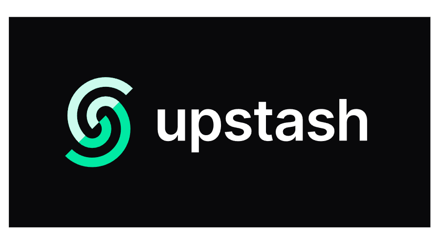

## Build and Deploy a Chat Application That Scales Horizontally with WebSockets and Upstash Redis

## Thank you to Upstash for sponsoring this video!

<br />
Upstash is a serverless data platform that provides serverless Redis, kafka & QStash.

## Who is this video for?
1. Those who are already familiar with JavaScript/TypeScript

## Features
1. Send and receive messages
1. Show current connection count

## What will you learn?
1. Create realtime communications with WebSockets
1. Use Redis Pub/Sub to communicate across multiple instances
1. Use Redis to stop data (connection count/ messages)
1. Use Docker and docker-compose to containerize the application
1. Docker multi-stage builds
1. Use GitHub actions to automate CI/CD
1. Graceful shutdowns

## What are we using?
1. Fastify - Backend
1. Websockets - Realtime 
1. Next.js - Frontend
1. Tailwind & Shadcn UI - Styling
1. Redis - Pub/Sub
1. Docker/docker-compose - Containerization
1. GitHub actions - CI/CD
1. DigitalOcean - Host the backend
1. Vercel - Host the frontend

## What will you need?
1. [Upstash account](https://upstash.com/)
1. [Node.js](https://nodejs.org/en)
1. [Docker & docker-compose](https://docs.docker.com/engine/install/)
1. An editor - [VSCode](https://code.visualstudio.com/)
1. [DigitalOcean](https://www.digitalocean.com/) account
1. [Vercel](https://vercel.com/) account
1. [Vercel CLI](https://vercel.com/docs/cli)
1. [GitHub](https://github.com) account


## Video structure
1. Build backend
1. Dockerise backend
1. Deploy backend
    1. Create DigitalOcean droplet
    1. Configure droplet
    1. Write github action
1. Build frontend
1. Deploy frontend 

## Debugging
### Websockets
1. Make sure you are using `wss://` and not `ws://` in production
2. Use debug mode in Caddy server
```
{
    debug
}
```

### Docker
1. List our running docker containers
```bash
docker ps
```
1. Stop a running container
```bash
docker stop <container id>
```

1. Remove a container
```bash
docker rm <container id>
```

1. List out networks
```bash
docker network ls
```

1. Remove a network
```bash
docker network rm <network id>
```
